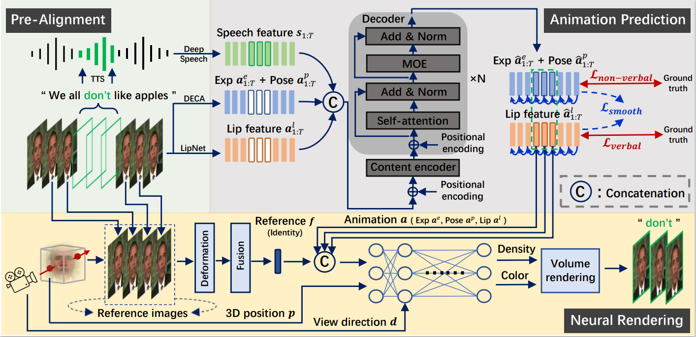

    

        <h2>Abstract</h2>
        

Talking-head video editing aims to efficiently insert, delete, and substitute the word of a pre-recorded video through a text transcript editor. The key challenge for this task is obtaining an editing model that generates new talking-head video clips which simultaneously have accurate lip synchronization and motion smoothness. Previous approaches, including 3DMM-based (3D Morphable Model) methods and NeRF-based (Neural Radiance Field) methods, are sub-optimal in that they either require minutes of source videos and days of training time or lack the disentangled control of verbal (e.g., lip motion) and non-verbal (e.g., head pose and expression) representations for video clip insertion. In this work, we fully utilize the video context to design a novel framework for talking-head video editing, which achieves efficiency, disentangled motion control, and sequential smoothness. Specifically, we decompose this framework to motion prediction and motion-conditioned rendering: (1) We first design an animation prediction module that efficiently obtains smooth and lip-sync motion sequences conditioned on the driven speech. This module adopts a non-autoregressive network to obtain context prior and improve the prediction efficiency, and it learns a speech-animation mapping prior with better generalization to novel speech from a multi-identity video dataset. (2) We then introduce a neural rendering module to synthesize the photo-realistic and full-head video frames given the predicted motion sequence. This module adopts a pre-trained head topology and uses only few frames for efficient fine-tuning to obtain a person-specific rendering model. Extensive experiments demonstrate that our method efficiently achieves smoother editing results with higher image quality and lip accuracy using less data than previous methods. 
        

    

    

        <h2>Pipeline</h2>
        </img>
    

    

        <h2>Demo Video</h2>
        

                <video width="860" height="540" src="media/demo.mp4" allowfullscreen controls></video>
        

    

